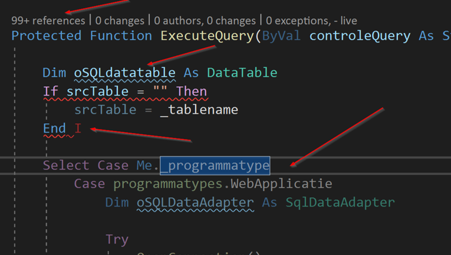
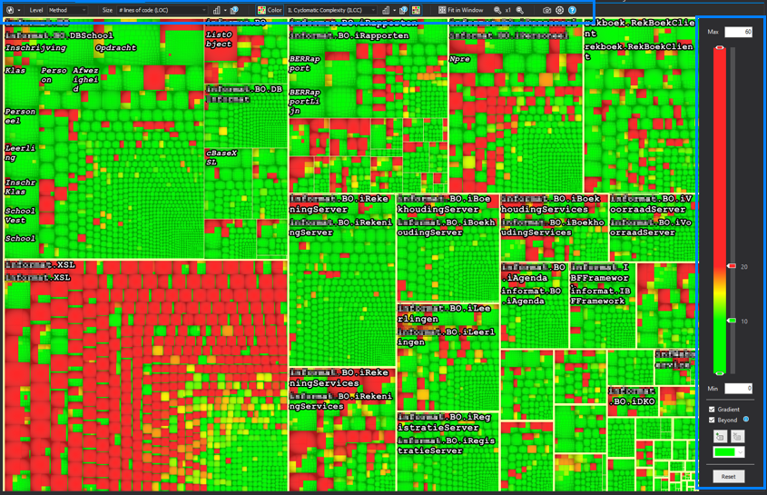
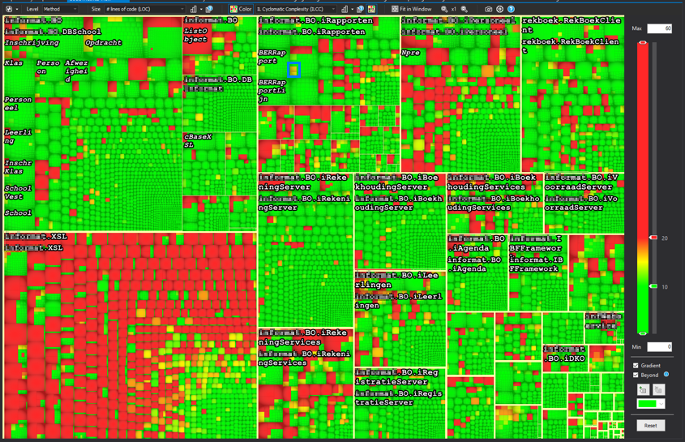
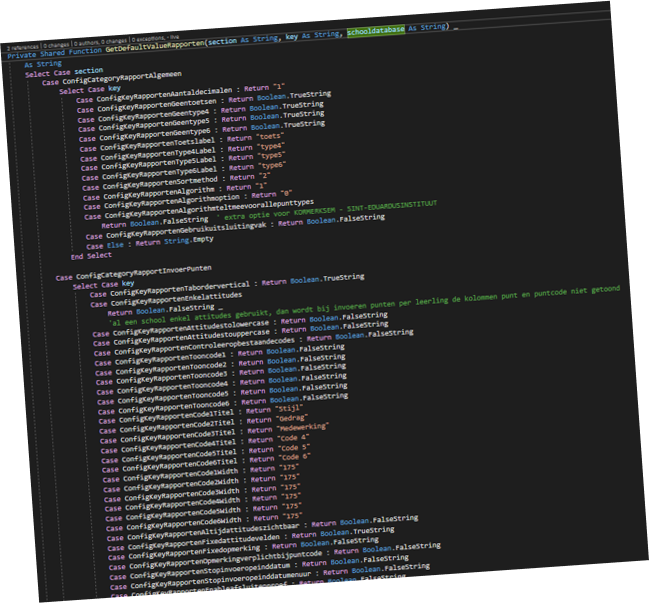
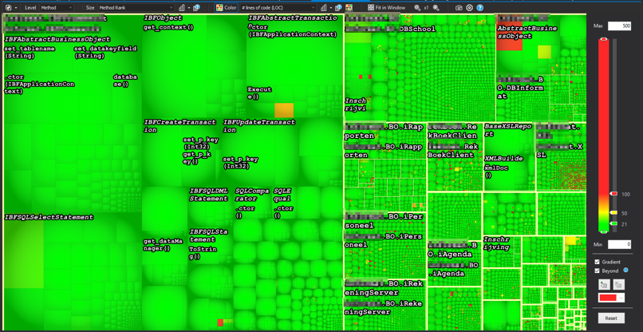
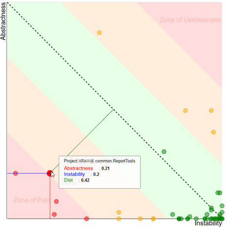
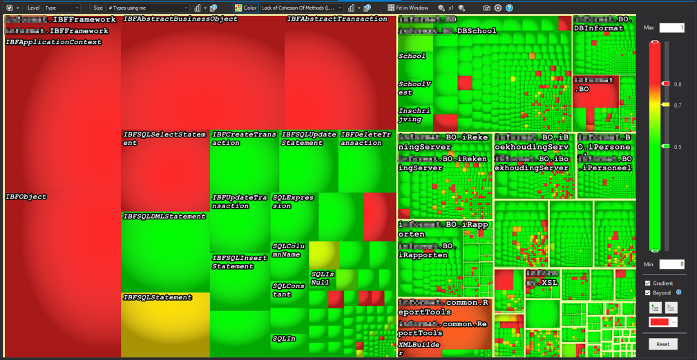

# Introduction

A few weeks ago, I was asked to look into static code analysis, mainly with the tool
nDepend. I had never had any experience with static code analysis yet, and was fairly
curious about what this was all about. 

In this blogpost I will be talking about what static code analysis is, what the 
difference is with dynamic code analysis and when to use it. After that I will be 
talking about some metrics and conclusions you can get from a static code analysis
tool and I will be ending my post with a small overview what nDepend has to offer.

# Static code analysis
## What is it?
You might not know it, but in most IDE's we already use static code analysis all the
time. However wrapped into a nice package known as IDE features. 



As you can see in the image above, I can get 4 kinds of static code analysis from
this small piece of software alone. 
 - On top we have codelens, informing us how many times and where the function is used
 - The blue squiggly line indicates we have a local variable that does not comply to the local coding conventions
 - The red squiggly line indicates we should expect a build error on that line
 - The slightly dimmed code below tells us that code is actually unreacheable.

## Static vs Dynamic code analysis
We can define the difference between static and dynamic code analysis as follows:

| Static code analysis | Dynamic code analysis|
|----------------------|----------------------|
| Code is not running  | Code is in a running state |
| Analysing code itself | Analysing features |
| For obvious probles & code smells | For everything else |
| Examples: Code style & smells, metrics, ... | Examples: Memory & CPU pressure, Debugging, ... |

In short: Static code analysis focusses most on code quality in the domain of 
maintainability & readability. Dynamic code analysis focusses in the field of
features and performance.

# Static code metrics
In this chapter i will focus on the four metrics I think are the most important 
ones for your code. I might update some new metrics later, but in my humble opinion
these are key for your code.

## Cyclomatic Complexity
Quite a mouthful as a word. When this metric is measured, it will count every ```if```, ```else```, ```switch```, ```goto```, ```for```, ```while``` and every
other known code-flow-changing keyword. This count results in the Cyclomatic 
Compexity.

To make it a little more easy to understand: Cyclomatic complexity measures the
amount of code paths in a method.

It is a good practice to keep your complexity under 10. Methods between 10 and 20
can exists but should be rather rare. Methods with a complexity of 20 and above 
should be refactored by the earliest convenience. 

When you request the metric to be displayed, it shows up like this:


The first time I saw this one, I was like: what am I looking at? Ain't nobody can
read that. But I got it figured out, and this is how it works: 

### Reading an nDpend metrics chart
#### Settings on top and to the right


On the top you will find the following:

| Item | What it controls |
|------|------------------|
| Level | The smalles part of the chart you will see, and subsequently the metrics that are available |
| Size | The metric controlling the size of the boxes |
| Color | The metric controlling the color of the boxes |

On the left you will find a slider and some minor settings, controlling what level
of the `Color`-selected-metric correspondents with what color.


#### Boxes, boxes, boxes


Inside the blue square you see the biggest kind of box in the graph. Surrounded by a
thick yellow line (remember: never eat yellow lines) you will find all code within an
assembly. 

For this example specifically, the `size` setting has been set to lines of code. 
This means the size of the box represents the amount of lines in the code, relative
to all lines of code in the solution.


This time the blue square surrounds a namespace. It's not so clear to see, but the 
namespace is being surrounded by a thin, non-edible yellow line. The size is again
a representation of the amount of lines of code.


The next step in this graph is evidently a class. They are found by looking at the
slightly darker borders making a square. And you guessed it correctly, again the size
is dependant on the lines of code.



The final and smalles part in the chart is a method. They should be hard to see in 
an overview this large, but the codebase has some big (read: huge) methods in there.

All these levels together give you a nice overview on how the distribution of lines
of code is in your solution. 

#### Color


Going back to the cyclomatic complexity graph without any blue boxes. When we look
at the colour settings you see that I have selected the "IL Cyclomatic Complexity" 
as a metric for the color metrics. On the left you can see that I've set the green 
bar at 10 and the red bar at 20. 

This results in all methods having a complexity equal or less than 10 to be green. 
Methods with a complexity between 10 and 20 are a shade of green, yellow or red-ish. 
All methods above 20 are red in this example. As you can see there are quite some 
complex methods in the system, with the bulk of them on the bottom left corner in 
the XSL assembly.

#### Diving to your method


Whenever you click a "box" in the graph, you get redirected to the method representing
that box. The example above has a cyclomatic complexity of 723 (only part of the method
is displayed here, the full method is around 500 lines long).

## Lines of code

> The first rule of functions is that they should be small. The second rule of functions 
> is that they should be smaller than that. 
> 
> "Uncle" Bob - Robert C. Martin

Uncle bob also specifies some numbers regarding this. However he does state that these 
numbers are based only on his gutfeeling and his experience. 
He states that functions should not be a 100 lines long. In fact they should hardly be
20 lines long. 



This is the same codebase as the previous example. However the size of the boxes are
dependent on it's rank now. Rank is a metric based on the Google Rank system where 
methods and classes that are used more, are bigger, and the least used are the small
boxes. The color represents the lines of code. From this metric you can see that the
code ranked the highest are actually not that bad in regards of lines of code.  Almost
all of them are beneath 20 lines of code, a few are above 50 and some rare ones are
above 100. 

## Instability vs abstractness
This is actually a metric in the scope of the assembly. It produces a nice graph where
you can get some meaningfull insights very quick. But first I need to introduce you to
stability and abstractness themselves.

### Stability
In the context of code analysis, stability means how stable code should be, and not how
stable code really is. You can also describe stability as "how difficult and risky is
it to change something about this code". 

When talking about stability, it actually boils down to this: if something in your code
is referenced a lot, it is hard to change. Ever tried removing a parameter in a method
referenced 100 times? That method is stable code.

When talking about assemblies, stable assemblies mean that this particular assembly has
lots of incoming references, regardless on where in the assembly they land. 

### Abstractness
Abstractness is a bit easier to explain: it's a number between 0 and 1. A zero means 
the assembly contains only implementations. An assembly gets rewared a 1 when all the
types within the assembly are only interfaces or abstract classes.

### Stability vs Abstractness
Combining the two together, you can get the following graph:


When designing your application, you have to take both instability and abstractness
into your mind. A good designed appliction will have stable abstract types and
unstable implementations of those types. Combining these two gives you the best
chance in creating maintainable code. This is however the theory, and the image
above shows you how good your code behaves in this aspect.

In the center you have the green zone. This is the place you want your assembly to
be. It goes from the fully abstract stable assemblies in the top left to the 
unstable but implemented zone on the right bottom. 

Next to the green zone you will find the orange "Danger Zones". These are assemblies
that are moving in the wrong direction, but are not that bad (yet).

In the top right corner you will find the "Zone of Uselessness". Assemblies ending
up here are abstractions that are not very usefull like an assembly of all kinds
of interfaces but those interfaces are used in only one other assembly.

The bottom right corner is the worst place to find your assembly in. The "Zone of
Pain" is the place where you have code that is referenced a lot, but are all
implementations instead of abstractions. The zone of pain is the place you find yourself
fixing a bug because of a code change you did not expect to affect that many things.

## Coupling & Cohesion
When designing software, you should take the following into account:

> Software should have low coupling and high cohesion

But what does this actually mean?

### Coupling
A methods and classes are coupled to each other when one uses a part of the other. For
example when you have a method in your class doing this: 

```cs 
var test = new DateTime(2019, 01, 01);
```

Your class is now coupled with the DateTime object. Any changes to the DateTime object
will reflect changes in your code, and can break your code. Thankfully the DateTime
object is a very stable .net framework object that is unlikely to change.

In your own code however you want your classes to be coupled to very little other of
your own classes. It's much better to be coupled to an interface than an implementation.
(see SOLID principles).

When measuring coupling from a certain class, there are 2 types:
 - Afferent coupling: number of entities (methods/classes/assemblies) that are dependend on this entity
 - Efferent coupling: number of entities (methods/classes/)assemblies) that this entity depends upon

 In both cases, you want that number to be as low as possible to keep your maintainability as high as possible.

 ### Cohesion
 A class is cohesive if everything that the class needs to do it job is within the class. This is a very hard thing to measure, so they made a metric that might do the
 trick a bit.

 The LCOM (Lack of cohesion) is a number between 0 and 1. A class containing only
 methods using all of the internal fields get rewarded with a nice 0. When none
 of the methods in the class use any of the internal fields, it gets a nice 1. 

 A result below 0.5 is considered as a good result. Above 0.7 there might be a small 
 problem and above 0.8 you're not very cohesive. Keep this number as low as possible
 aw well.

 ### Coupling & Cohesion together
 

 This time the box size is the amount of types using the specific class. The color
 is the lack of cohesion of the methods in that type. The type on the top right could
 be a class that is badly designed, because it's functionality is not contained within
 the specific class.